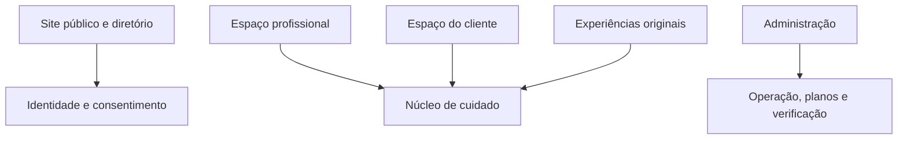
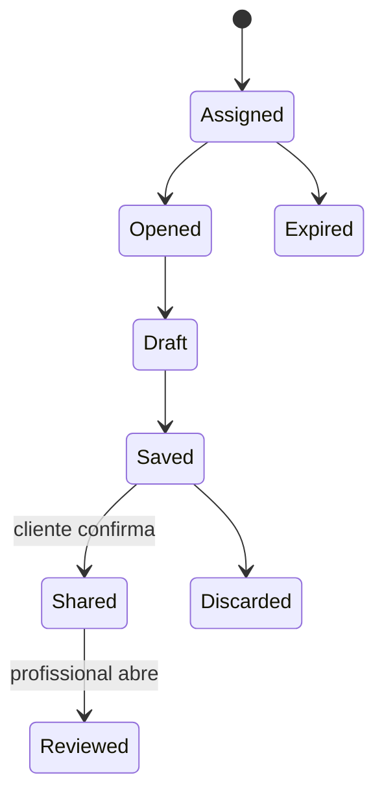
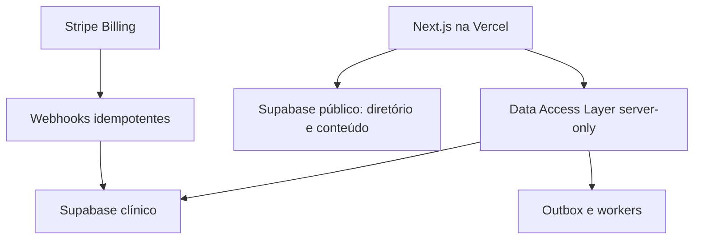
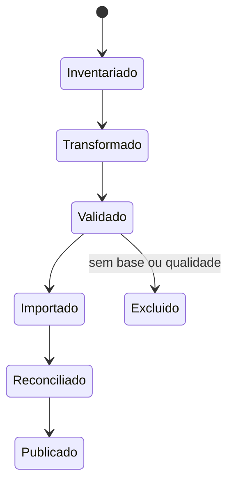
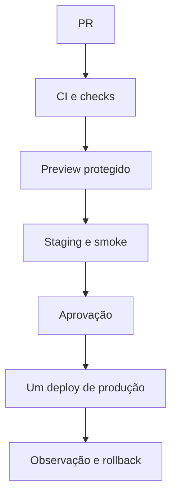

# Além da Sessão — arquitetura completa da plataforma de continuidade terapêutica

**Data:** 25 de julho de 2026  
**Estado:** arquitetura de referência implementada como fundação local — revisão 4  
**Stack imposta:** TypeScript, React/Next.js, Tailwind CSS, shadcn/ui, Supabase e Vercel  
**Localizações fundadoras:** português de Portugal (`pt-PT`) e português do Brasil (`pt-BR`)

> **Revisão de arquitetura:** o novo produto é independente do `lostlettersroom.com` e não importa o seu universo conceptual. Arquivista, Atlas, Real Letters, Tales e Arquivo permanecem exclusivos do Lost Letters Room. O que transita é o nível de autoria, atmosfera, ritual, cuidado emocional e conhecimento técnico — aplicado a experiências novas, com metáforas e sistemas próprios.

---

## 0. Decisão executiva

A ideia tem potencial real, mas o produto certo não é “Lost Letters Room + agenda para psicólogos”. Deve ser uma **plataforma de continuidade terapêutica conduzida por profissionais**, composta por:

1. um sistema operativo de consultório para psicólogos e, numa segunda fase, psiquiatras;
2. um espaço privado e simples para clientes;
3. um motor extensível de experiências entre sessões;
4. um diretório público de profissionais verificados e um fluxo de contacto/agendamento;
5. uma administração comercial e operacional que, por desenho, não é uma janela para conteúdo clínico;
6. um catálogo autoral de experiências originais, cada uma com verdade humana, metáfora, ritual e identidade próprios.

A proposta não é única por juntar agenda, prontuário, portal e exercícios. Produtos como SimplePractice, TheraPlatform, Medesk e Quenza já ocupam partes desse território. A oportunidade está numa combinação ainda subaproveitada: **profundidade experiencial autoral + supervisão humana + localização cultural séria em `pt-PT` e `pt-BR` + privacidade compreensível + operação de consultório**.

“A mesma experiência” descreve a qualidade procurada, não a repetição da forma:

- o novo site tem marca, domínio, aplicação, contas, cookies, analytics, base de dados, termos e operação próprios;
- cada ferramenta deve parecer um lugar significativo, não um formulário clínico decorado;
- nenhuma experiência usa Arquivista, Atlas, Real Letters, Tales, Arquivo ou uma versão renomeada desses conceitos;
- conteúdo reaproveitável só entra após inventário, transformação e adequação ao novo contexto;
- contas, sessões, identificadores técnicos e consentimentos do Lost Letters Room não transitam;
- os produtos evoluem separadamente, sem integração ou sincronização.

### Tese do produto

> A sessão não termina quando a chamada acaba ou a pessoa sai do consultório. O que acontece entre duas sessões pode chegar à próxima com forma, contexto e consentimento — sem substituir o profissional e sem transformar a pessoa num conjunto de métricas.

### Posicionamento recomendado

**Não é terapia por IA. Não é uma rede social de saúde mental. Não é apenas um prontuário.**  
É a infraestrutura que permite ao profissional acompanhar o processo e ao cliente trabalhar entre sessões sem ficar sozinho com uma folha genérica, um chatbot ou um formulário frio.

### Marca escolhida

O produto chama-se **Além da Sessão** e usará `alemdasessao.com` quando Henrique
autorizar o lançamento. Durante a validação, o domínio não é ligado, não existe
deploy e todas as superfícies permanecem em ambiente local com dados sintéticos.
“Estruturas de Carga” continua a ser uma ferramenta específica e nunca a
metáfora global da plataforma.

---

## 1. O que aproveitar — e o que rejeitar — de “O Peso Que Carregas”

### 1.1 O que tem valor

- A metáfora de engenharia é forte, coerente e visualmente traduzível sem som ou vídeo.
- O ritual em três atos cria mais intenção do que um formulário comum.
- O limite de texto ajuda a evitar relatos sem forma.
- A ausência de gostos, comentários e rankings protege o tom.
- O sistema procedural de blocos pode gerar identidade visual determinística e barata.
- A ideia reconhece uma verdade humana relevante: muitas pessoas sustentam responsabilidades que não conseguem mostrar sem recear que algo à sua volta desabe.

### 1.2 O que precisa ser descartado

| Elemento proposto pelo Gemini                          | Problema                                                                                              | Decisão                                                                                                        |
| ------------------------------------------------------ | ----------------------------------------------------------------------------------------------------- | -------------------------------------------------------------------------------------------------------------- |
| Proibir palavras como “sinto-me”, “chorar” ou “triste” | Pode reforçar precisamente a supressão emocional que o contexto terapêutico deveria permitir explorar | Trocar proibição por escolha de lente: **factos**, **impacto**, **necessidades** e **emoções** podem coexistir |
| “Nível 5: colapso irreversível em terceiros”           | Amplifica culpa, hipervigilância e fantasias de indispensabilidade                                    | Substituir por consequências observáveis, sem dramatização nem pseudo-diagnóstico                              |
| `mass_index = meses × impacto`                         | Dá aparência científica a uma medida inventada                                                        | Não calcular um “peso” clínico; usar composição visual sem ranking                                             |
| Mural público como núcleo                              | Dados aparentemente anónimos podem revelar saúde, família, empregador e circunstâncias identificáveis | Na Plataforma, a experiência é privada por defeito; publicação pública é outro produto e outro consentimento   |
| Segurar quatro segundos para “ajudar”                  | Gamifica relatos graves e cria popularidade desigual                                                  | Remover do percurso clínico; numa obra pública futura, usar apenas gesto simbólico sem contadores competitivos |
| Moderação por rejeição de emoções                      | Pode desumanizar e produzir viés cultural                                                             | Moderação por segurança, identificação, ataque e inadequação — nunca por “sentir demais”                       |
| Admin protegido por password simples                   | Inaceitável para qualquer sistema com dados de saúde                                                  | Contas individuais, MFA obrigatório, autorização por função e auditoria                                        |
| `ip_hash` como proteção suficiente                     | Não resolve abuso, consentimento, retenção nem reidentificação                                        | Rate limit em camadas, minimização, rotação de sal e política de retenção curta                                |
| `localStorage` e `beforeunload` para acumular ações    | `beforeunload` não é garantia de entrega e armazenamento local é inadequado para conteúdo íntimo      | Rascunho em memória; escrita explícita e idempotente; outbox apenas para eventos não sensíveis                 |
| RPC `SECURITY DEFINER` aberta                          | Sem `search_path`, grants e verificação de autorização, aumenta risco de escalada e abuso             | Funções mínimas, schema qualificado, `search_path` vazio, grants explícitos e testes de RLS                    |
| Coluna gerada com `now()`                              | Expressões de colunas geradas em PostgreSQL precisam ser imutáveis; `now()` não é                     | Calcular duração em leitura ou atualizar por job controlado                                                    |
| Promessa “PageSpeed 100/100”                           | Não é uma garantia técnica séria                                                                      | Definir budgets e métricas de campo                                                                            |
| “Radicalmente único”                                   | Não foi demonstrado e há produtos adjacentes                                                          | Posicionar com honestidade na combinação e na qualidade de execução                                            |

### 1.3 Como a ferramenta deve existir dentro da Plataforma

**Nome de trabalho:** Estruturas de Carga  
**Tipo:** experiência reflexiva orientada  
**Modo padrão:** privado  
**Pode ser atribuída por:** profissional  
**Pode ser iniciada livremente por:** cliente, se o profissional habilitar o catálogo autónomo  
**Partilha:** apenas após revisão explícita do cliente  
**Resultado partilhado:** snapshot imutável; edições posteriores não alteram silenciosamente o que o profissional recebeu  
**Uso clínico:** material para conversa, nunca score diagnóstico  
**Publicação:** fora do MVP clínico

Novo ritual:

1. **Aquilo que sustento** — responsabilidade concreta, contexto e duração.
2. **Como a estrutura responde** — efeitos observáveis em mim, noutras pessoas e no quotidiano.
3. **Onde há apoio e onde falta** — o que já sustenta a pessoa, o que poderia ser redistribuído e o que deseja levar à sessão.
4. **Revisão** — a pessoa vê exatamente o que será guardado.
5. **Escolha de destino** — guardar só para si, partilhar um snapshot com o profissional ou descartar sem rasto.

O produto preserva a força da metáfora, mas deixa de glorificar a pessoa como pilar que não pode cair.

---

## 2. Princípios não negociáveis

1. **Humano no centro, profissional no circuito.** A ferramenta prepara, organiza ou prolonga a reflexão; não diagnostica, não prescreve e não responde como terapeuta.
2. **Privado por defeito.** Criar não significa partilhar. Guardar não significa autorizar acesso profissional.
3. **Consentimento granular e compreensível.** Conta, cuidados, partilha, diretório, marketing, pesquisa e publicação pública são finalidades diferentes.
4. **Sem vigilância disfarçada.** O cliente sabe o que o profissional consegue ver, quando viu e o que permanece privado.
5. **Sem pontuação da pessoa.** Métricas operacionais podem existir; “engagement score”, “risco emocional” ou “progresso” opaco não.
6. **Sem IA como substituto.** Nenhuma experiência essencial depende de IA generativa. Qualquer IA futura é opt-in, contratualmente isolada e sujeita a revisão humana.
7. **Sem conteúdo clínico em analytics, logs, URLs, notificações ou nomes de ficheiros.**
8. **Autorização no servidor e na base de dados.** Esconder um botão não é controlo de acesso.
9. **Localização como produto.** `pt-PT` e `pt-BR` têm terminologia, exemplos, legal, emails, datas, moeda, apoio urgente e tom próprios.
10. **Estados honestos.** `vazio`, `sem permissão`, `não sincronizado`, `erro`, `eliminado`, `expirado` e `indisponível` nunca são colapsados no mesmo ecrã.
11. **Rascunho íntimo em memória.** Nada de Web Storage/IndexedDB por defeito para texto terapêutico.
12. **Uma só publicação após validação.** Ambientes Preview e Staging fazem a verificação; produção recebe uma release deliberada.
13. **Contextos separados.** Descoberta pública, uso pessoal e uso clínico nunca partilham permissões, finalidade ou acesso implícito.
14. **Reaproveitar conteúdo não importa um universo.** Cada item herdado precisa de proveniência, elegibilidade, recontextualização e revisão editorial.

---

## 3. Âmbito do produto

### 3.1 Cinco superfícies, uma plataforma



#### Site público

- proposta de valor para profissionais e clientes;
- diretório de profissionais verificados;
- perfis públicos controlados pelo profissional;
- contacto e pedido de consulta;
- catálogo editorial das experiências;
- preços para profissionais;
- páginas de segurança, privacidade, acessibilidade e subprocessadores;
- conteúdo SEO localizado.

#### Hub de experiências

- catálogo de experiências originais, incluindo Estruturas de Carga e as futuras ferramentas;
- entrada livre pelo cliente quando o profissional habilitar essa possibilidade;
- atribuição contextual pelo profissional, com versão e objetivo explícitos;
- estado privado por defeito e partilha apenas por snapshot confirmado;
- progressão e artefactos digitais quando servirem à metáfora da ferramenta;
- direção visual própria por experiência, sem copiar a linguagem narrativa do Lost Letters Room;
- valor independente de som, vídeo, IA generativa ou uma comunidade inicial.

#### Espaço profissional

- agenda, disponibilidade, bloqueios e lista de espera;
- clientes, contactos e relações de cuidado;
- pedidos, onboarding, consentimentos e formulários;
- notas clínicas versionadas;
- atribuição de experiências e revisão do que foi partilhado;
- documentos;
- pagamentos e situação financeira;
- relatórios operacionais;
- equipa, permissões e configurações.

#### Espaço do cliente

- próximas sessões e pedidos;
- tarefas/experiências disponíveis;
- rascunhos privados e resultados guardados;
- partilhas ativas e histórico de snapshots;
- documentos e consentimentos;
- pagamentos;
- privacidade e exportação.

O cliente pode iniciar uma experiência por vontade própria ou por atribuição profissional. Em ambos os casos, o resultado continua privado até uma decisão explícita. Explorar o catálogo público não cria automaticamente um registo clínico.

#### Administração

- profissionais e verificação de credenciais;
- organizações, planos, assinaturas e entitlements;
- catálogo/versionamento das ferramentas e localizações;
- moderação apenas do conteúdo público;
- saúde do sistema, filas, webhooks e incidentes;
- suporte com acesso excecional, temporal e auditado;
- métricas agregadas sem conteúdo clínico.

### 3.2 MVP de mercado

O primeiro produto pago deve servir **psicólogos individuais e pequenas clínicas**, apenas com clientes adultos. A arquitetura contém `provider_type`, equipas, dependentes e tutores, mas:

- psiquiatria entra depois de o núcleo clínico e os requisitos de registo estarem validados;
- menores entram depois de existir modelo completo de tutela, consentimento e acesso;
- prescrição eletrónica, receitas, diagnóstico automático, testes psicométricos proprietários, seguros e teleconsulta nativa ficam fora do MVP;
- o MVP não é um SRES universal nem um dispositivo médico;
- videochamada pode ser um link externo no agendamento, sem o produto processar vídeo;
- contacto significa pedido de consulta e comunicação assíncrona segura, não chat em tempo real.

Esta restrição não reduz a visão. Evita que o primeiro lançamento acumule simultaneamente risco clínico, fiscal, regulatório e técnico.

### 3.3 Diferenciação que deve sobreviver sem o design

O profissional atribui uma experiência que não parece uma ficha burocrática. O cliente realiza-a ao seu ritmo, decide o que permanece só seu e partilha uma versão congelada quando quer. O profissional recebe esse material no contexto certo da relação e da próxima sessão. A plataforma reduz trabalho administrativo, mas o produto memorável é a **ponte consentida entre duas sessões**.

---

## 4. Pessoas, organizações e autorização

### 4.1 A unidade de isolamento é a organização

Uma organização pode ser um consultório individual ou uma clínica. Todas as linhas pertencentes a uma prática têm `organization_id`. Uma pessoa autenticada pode participar em várias organizações, com uma função distinta em cada uma.

| Papel                 | Pode fazer                                                                    | Não pode fazer                                          |
| --------------------- | ----------------------------------------------------------------------------- | ------------------------------------------------------- |
| `organization_owner`  | gerir plano, equipa, políticas e todos os clientes autorizados da organização | contornar privacidade de rascunhos do cliente           |
| `clinician`           | gerir os próprios clientes/relações, agenda, notas e atribuições              | ver clientes de colegas sem relação ou delegação        |
| `clinical_supervisor` | consultar casos explicitamente atribuídos para supervisão                     | acesso global por ser “supervisor”                      |
| `assistant`           | gerir agenda, contactos e pagamentos autorizados                              | ver notas, respostas de ferramentas ou conteúdo clínico |
| `billing_manager`     | faturação e situação de pagamentos                                            | ver conteúdo terapêutico                                |
| `client`              | gerir a própria conta, experiências e partilhas                               | ver notas privadas do profissional                      |
| `guardian`            | gerir apenas o âmbito autorizado de um dependente                             | acesso implícito a tudo o que o menor produziu          |
| `platform_support`    | diagnóstico operacional mínimo                                                | abrir conteúdo clínico por conveniência                 |
| `platform_admin`      | planos, verificação, catálogo, operação                                       | consultar dados clínicos no dashboard comum             |
| `security_admin`      | incidentes e acesso de emergência com dupla autorização                       | acesso permanente                                       |

As funções de equipa são RBAC; o acesso concreto a um cliente é ABAC: depende da organização, relação de cuidado, delegação, finalidade, estado e nível de autenticação.

### 4.2 Relações que não podem ser fundidas

- `auth_user`: identidade de login;
- `person_profile`: preferências gerais, nome e locale;
- `professional_profile`: credenciais e perfil profissional;
- `public_professional_profile`: projeção explicitamente publicável;
- `client_record`: registo criado numa organização;
- `care_relationship`: vínculo entre cliente e profissional;
- `organization_membership`: vínculo de um utilizador à prática.

Um cliente pode ter o mesmo email em relações com profissionais diferentes sem que um consultório veja o outro. O `client_record` não é uma extensão pública do perfil da pessoa.

### 4.3 Verificação profissional

Estados:

`draft → submitted → under_review → verified → renewal_due → suspended | rejected`

Requisitos mínimos:

- país e tipo profissional;
- número de cédula/registro;
- conselho/ordem e região;
- nome legal compatível;
- documento comprobatório privado;
- data da verificação e próxima revisão;
- trilho do moderador que decidiu;
- mecanismo de suspensão rápida do perfil público.

Brasil permite consulta pública no Cadastro Nacional de Profissionais de Psicologia; Portugal permite pesquisa de médicos registados, mas os fluxos variam por profissão. O MVP deve usar verificação manual assistida, não scraping frágil nem alegações de parceria com ordens profissionais.

---

## 5. Jornadas principais

### 5.1 Profissional: adesão até primeiro cliente

1. Escolhe `pt-PT` ou `pt-BR`.
2. Cria identidade e verifica email.
3. Configura MFA obrigatório.
4. Cria consultório.
5. Indica profissão, jurisdição e credenciais.
6. Aceita termos do serviço e acordo de tratamento de dados aplicável.
7. Envia credenciais para verificação.
8. Configura agenda, timezone, modalidades, duração e política de cancelamento.
9. Personaliza página pública sem afirmações clínicas não verificadas.
10. Convida um cliente existente ou publica disponibilidade.
11. Só depois da verificação o perfil fica pesquisável e pedidos públicos são aceites.

### 5.2 Cliente: encontrar e contactar

1. Pesquisa por país/região, modalidade, língua, área de atuação declarada e disponibilidade.
2. Vê um perfil com credenciais verificadas, preço indicativo, política e meios de atendimento.
3. Envia pedido ao profissional escolhido.
4. A Plataforma recolhe apenas o mínimo: contacto, disponibilidade e uma mensagem curta opcional.
5. Não pede diagnóstico na primeira mensagem.
6. O profissional aceita, recusa ou propõe horário.
7. A pessoa cria conta apenas quando necessário; recusar o pedido não cria um prontuário clínico completo.

Não deve existir ranking “melhor psicólogo”, score de compatibilidade opaco ou recomendação baseada em inferir saúde mental. A pesquisa começa por filtros verificáveis.

### 5.3 Agendamento

Estados:

`requested → held → confirmed → completed | cancelled_by_client | cancelled_by_professional | no_show`

Regras:

- datas persistidas em UTC e apresentadas no timezone da organização/pessoa;
- um `hold` expira automaticamente;
- confirmação e cancelamento são idempotentes;
- conflito é impedido na base de dados, não apenas no calendário visual;
- recorrência gera ocorrências, não uma série impossível de auditar;
- emails e push nunca revelam assunto clínico;
- a modalidade pode conter endereço privado ou URL externa, entregue apenas a participantes autorizados.

### 5.4 Nota clínica

`draft → signed → amended`

- Draft é editável pelo autor e, se configurado, pelo supervisor.
- Signed é imutável.
- Uma correção cria amendment, preserva a versão anterior e regista motivo.
- Autosave é explícito no estado e nunca mostra “guardado” antes do commit confirmado.
- O cliente não recebe acesso automático a notas internas; pedidos de acesso/exportação seguem o fluxo jurídico e profissional apropriado.

### 5.5 Experiência entre sessões



1. O profissional atribui uma versão concreta da ferramenta com uma mensagem curta.
2. O cliente abre e vê objetivo, duração estimada, privacidade e destino dos dados.
3. O rascunho vive em memória até `Guardar`.
4. Guardar não partilha.
5. Antes de partilhar, a pessoa vê uma pré-visualização integral.
6. A partilha cria um snapshot; não concede acesso silencioso ao histórico inteiro.
7. O profissional vê a origem, versão, data e escopo, e pode marcar como revisto.
8. Revogar impede novos acessos quando juridicamente possível; se o snapshot já integrou um registo clínico sujeito a retenção, a interface explica essa consequência antes da partilha.

### 5.6 Relação com o Lost Letters Room

O Lost Letters Room continua integralmente no seu próprio universo. A nova Plataforma não contém:

- Arquivista;
- Atlas;
- Real Letters;
- Tales;
- Arquivo;
- envelopes como ritual central;
- uma “Sala”, “Biblioteca” ou “Atelier” que apenas renomeie as mesmas funções;
- cartas não enviadas como eixo conceptual do produto.

Esses elementos não serão migrados, integrados ou reformulados com nomes diferentes.

#### O que “a mesma experiência” significa

O objetivo é transportar uma disciplina criativa:

- partir de uma necessidade humana real e imediatamente reconhecível;
- transformar essa necessidade num ritual, não apenas numa pergunta;
- oferecer alívio, descoberta, forma ou uma escolha emocionalmente significativa;
- usar metáfora e direção visual como parte do significado;
- preservar autonomia, privacidade e ausência de julgamento;
- fazer a pessoa sentir que entrou num lugar pensado, sem construir uma rede social;
- permanecer interessante quando explicado sem falar do design.

Cada nova experiência deve encontrar a sua própria verdade, vocabulário, objetos, progressão e gesto central. Se uma proposta ainda puder ser descrita como “Lost Letters Room para terapia”, não está suficientemente separada.

#### O que pode ser reaproveitado

| Camada                           | Pode transitar                                                                         | Não pode transitar                                                             |
| -------------------------------- | -------------------------------------------------------------------------------------- | ------------------------------------------------------------------------------ |
| Conhecimento de produto          | ritual, progressive disclosure, estados honestos, acessibilidade e segurança emocional | lore, personagens, lugares e taxonomia do Lost Letters Room                    |
| Engenharia                       | padrões de performance, localização, testes, proveniência e consistência               | dependências pesadas, falhas conhecidas ou código acoplado ao universo antigo  |
| Sistema visual                   | qualidade de composição, cuidado tipográfico e atmosfera                               | papel, tinta, mapas, selos ou envelopes como identidade automática             |
| Conteúdo editorial               | materiais gerais que possam ser recontextualizados e revistos                          | Arquivista, Atlas, Real Letters, Tales, Arquivo e narrativas dependentes deles |
| Conteúdo criado por utilizadores | nada por presunção                                                                     | cartas, perfis, favoritos, históricos, rastreamento e consentimentos           |

Conteúdo reutilizável deve ser inventariado e reescrito quando necessário para servir a nova arquitetura. O objetivo não é copiar quase toda a superfície do Lost Letters Room; é não desperdiçar materiais editoriais e conhecimentos que continuem válidos fora daquele mundo.

#### Independência real

- base de dados, projetos Supabase, chaves, cookies e sessões próprios;
- sem “entrar com Lost Letters Room”;
- sem sincronização, webhooks, API, `iframe` ou redirecionamento funcional entre produtos;
- sem IDs de analytics, IP hashes, perfis ou consentimentos transportados;
- sem associação comercial ou clínica obrigatória entre as marcas;
- sem dependência do site antigo para completar qualquer jornada.

---

## 6. Arquitetura de informação e rotas

```text
app/
  [locale]/
    (public)/
      page.tsx
      profissionais/
      profissionais/[slug]/
      experiencias/
      experiencias/[slug]/
      recursos/
      recursos/[slug]/
      precos/
      seguranca/
      privacidade/
      acessibilidade/
      subprocessadores/
      artigos/[slug]/
    (auth)/
      entrar/
      criar-conta/
      convite/[token]/
      recuperar/
      mfa/
    (professional)/
      pro/
        hoje/
        agenda/
        clientes/
        clientes/[clientId]/
        experiencias/
        financeiro/
        relatorios/
        equipa/
        definicoes/
    (client)/
      cuidado/
        hoje/
        sessoes/
        experiencias/
        experiencias/[assignmentId]/
        partilhas/
        documentos/
        pagamentos/
        privacidade/
    (admin)/
      admin/
        operacao/
        profissionais/
        organizacoes/
        assinaturas/
        experiencias/
        localizacoes/
        moderacao/
        incidentes/
```

Os segmentos de rota organizam layout e navegação; **nunca** concedem autorização. Cada loader, Server Action, Route Handler, RPC e política RLS volta a verificar o ator e o recurso.

### 6.1 Navegação profissional

Desktop:

- Hoje
- Agenda
- Clientes
- Experiências
- Financeiro
- Relatórios
- Equipa
- Definições

Mobile:

- Hoje
- Agenda
- Clientes
- Pendências
- Mais

O ecrã “Hoje” mostra apenas decisões acionáveis:

- próxima sessão;
- pedido novo;
- nota por assinar;
- experiência partilhada e ainda não revista;
- pagamento pendente;
- conflito ou falha operacional.

Não se deve preencher o dashboard com gráficos decorativos.

### 6.2 Navegação do cliente

- Hoje
- Sessões
- Experiências
- Partilhas
- Conta

O cliente não recebe uma versão reduzida do dashboard corporativo. A superfície deve parecer um lugar simples e seguro, com uma tarefa principal por ecrã.

### 6.3 Perfil de cliente

Separadores:

- Visão geral
- Linha do tempo
- Sessões
- Notas
- Experiências
- Documentos
- Pagamentos
- Consentimentos
- Acesso e auditoria

A linha do tempo mostra eventos permitidos por função. Assistentes veem agendamento e pagamento; profissionais autorizados veem eventos clínicos; o cliente vê o seu histórico de partilha. Não existe uma timeline universal entregue a qualquer membro da equipa.

---

## 7. Direção de experiência e sistema visual

As referências enviadas têm qualidades úteis: grelhas amplas, cartões claros, navegação lateral, calendários densos e uma cronologia visual. Também têm riscos: informação clínica reduzida a widgets decorativos, neon excessivo, texto pequeno e layouts que só funcionam num monitor largo.

### 7.1 Leitura concreta das referências

| Referência    | Aproveitar                                                           | Não copiar                                                              |
| ------------- | -------------------------------------------------------------------- | ----------------------------------------------------------------------- |
| Imagem 1      | agenda semanal legível, ação “adicionar” evidente, navegação lateral | colunas estreitas e texto minúsculo em mobile                           |
| Imagens 2 e 3 | linha temporal como forma de compreender a continuidade              | percentagens clínicas sem origem e excesso de informação no mesmo plano |
| Imagens 4 e 5 | composição modular por cartões e hierarquia de dashboard             | gráficos decorativos e métricas que não conduzem a uma ação             |
| Imagem 6      | sidebar recolhível e memória de preferência                          | icon-only sem labels/tooltips e ação principal flutuante sem contexto   |
| Imagem 7      | leveza, espaço negativo e assimetria controlada                      | visual de marketplace genérico para a área de cuidado                   |

Na Plataforma, calendário e operação podem ter densidade profissional; experiências e portal do cliente precisam de ritmo mais lento. Os dois usam os mesmos tokens e componentes, mas não a mesma densidade.

### 7.2 Linguagem visual recomendada

- base quente e humana, não “hospital branca”;
- superfícies claras e tinta escura para legibilidade;
- uma cor de ação contida;
- cores de estado nunca são o único sinal;
- cantos moderados e hierarquia por espaço, não por sombras excessivas;
- tipografia de interface altamente legível;
- uma fonte editorial apenas dentro das experiências autorais;
- ilustração e textura reservadas ao catálogo de experiências, não às notas clínicas;
- nenhum visual que pareça diagnóstico automatizado.

Tokens iniciais, sujeitos a exploração de marca:

```css
:root {
  --background: 42 28% 96%;
  --foreground: 210 10% 12%;
  --card: 40 24% 99%;
  --muted: 36 14% 91%;
  --muted-foreground: 214 8% 40%;
  --primary: 155 24% 31%;
  --primary-foreground: 40 30% 98%;
  --accent: 34 68% 54%;
  --destructive: 3 62% 48%;
  --border: 35 13% 82%;
  --ring: 155 30% 32%;
  --radius: 0.875rem;
}
```

Isto é uma direção de sistema, não uma identidade final.

#### Experiências: a mesma exigência emocional, uma linguagem nova

As experiências não devem parecer dashboards com uma ilustração por cima. Cada uma pode ter atmosfera e metáfora próprias, mas nenhuma parte automaticamente de papel, tinta, envelopes, mapas, arquivo ou outros códigos do Lost Letters Room.

Regras de execução:

- CSS e SVG para formas, materiais e microinterações sempre que bastarem;
- animação apenas quando explica o gesto, estado, descoberta ou transformação daquela ferramenta;
- módulos pesados isolados por rota e carregados sob pedido;
- Server Components e HTML estático para conteúdo editorial;
- progressive enhancement: compreender e concluir o ritual não depende da camada cénica;
- motores gráficos não entram no bundle do dashboard profissional;
- imagens e texturas responsivas, comprimidas e com limites por breakpoint;
- `prefers-reduced-motion`, foco estável e alternativas sem drag;
- nenhum autoplay e nenhum som necessário para compreender ou concluir a experiência.

O sistema visual tem dois modos sobre os mesmos tokens:

| Modo            | Objetivo                                     | Densidade                       |
| --------------- | -------------------------------------------- | ------------------------------- |
| **Care OS**     | agenda, clientes, notas, faturação e decisão | leve, direto e compacto         |
| **Experiência** | ritual, reflexão, descoberta e artefactos    | autoral, progressivo e variável |

A independência de bundles é obrigatória: visitar “Hoje” não descarrega animações, fontes editoriais secundárias nem assets específicos de qualquer experiência.

### 7.3 Mobile first real

- conteúdo funcional a partir de 320 px;
- alvo mínimo de interação de 44 × 44 px;
- formulários em coluna única;
- calendário mobile em lista/agenda, não uma semana desktop comprimida;
- ações principais fixas apenas quando não ocultam campos;
- tabelas viram listas ou cartões sem perder labels;
- modais longos viram páginas/sheets com URL recuperável;
- nenhuma interação depende de hover, drag, cor ou som;
- `prefers-reduced-motion` elimina física decorativa;
- foco visível, ordem lógica, headings e landmarks;
- erros associados ao campo e resumidos no topo;
- dialogs prendem foco, fecham por Escape e restauram o foco;
- conteúdo fechado não permanece exposto na árvore de acessibilidade.

Meta: WCAG 2.2 AA, com testes automáticos e revisão manual.

### 7.4 Componentes shadcn/ui

shadcn/ui é matéria-prima, não certificação de acessibilidade nem design final. Deve haver wrappers próprios:

- `AppButton`
- `SensitiveField`
- `PermissionGate`
- `AsyncState`
- `LocalizedDate`
- `Money`
- `ConfirmRiskyAction`
- `ClinicalStatus`
- `AuditStamp`
- `SharePreview`
- `ToolShell`

Os wrappers centralizam foco, estados assíncronos, telemetry segura, tradução e regras de permissão.

---

## 8. Arquitetura técnica

### 8.1 Escolha: monólito modular

Para uma pessoa construir e manter, microserviços seriam custo sem benefício. A recomendação é um **monólito modular TypeScript**, com fronteiras de domínio explícitas e dois planos de dados:



#### Plano clínico

- identidade da Plataforma;
- organizações, membros, clientes e relações;
- agenda e notas;
- assignments, respostas privadas e snapshots;
- documentos clínicos;
- consentimentos;
- billing metadata da assinatura;
- auditoria e outbox.

#### Plano público

- perfis publicáveis;
- conteúdo editorial e SEO;
- catálogo público de experiências;
- pedidos iniciais minimizados;
- conteúdo público próprio de cada experiência, quando existir;
- submissões anónimas opcionais, separadas por ferramenta e sujeitas a moderação;
- proveniência editorial e variantes localizadas.

Separar os planos reduz o raio de impacto e impede que uma experiência pública com UGC partilhe permissões com dados clínicos. O Lost Letters Room continua fora desta arquitetura, sem ligação em runtime nem módulos conceptuais replicados.

### 8.2 Monorepo

```text
/
  apps/
    web/                     # único Next.js App Router
  packages/
    ui/                      # design system e wrappers shadcn
    authz/                   # funções de autorização e permission matrix
    db/                      # tipos, DAL, transações e DTOs
    i18n/                    # routing, catálogos, formatadores, legal locales
    validation/              # Zod schemas partilhados
    observability/           # logs redigidos, traces e métricas
    notifications/           # adaptadores email/push
    billing/                 # Stripe e entitlements
    tool-runtime/            # estados, renderer, save/share protocol
    tool-registry/           # manifests publicados
    tool-load-structures/    # Estruturas de Carga
    experience-content/      # conteúdo, proveniência e variantes localizadas
    experience-publication/  # publicação opcional e moderação
    migration-content/       # importação seletiva; não vai para runtime
    testing/                 # fixtures e helpers
  supabase/
    clinical/
      migrations/
      seed/
      tests/
    public/
      migrations/
      seed/
      tests/
  scripts/
    inventory-content.ts
    migrate-content.ts
    reconcile-content.ts
    check-i18n.ts
    check-privacy.ts
    check-rls.ts
    check-tools.ts
    check-claims.ts
    check-accessibility.ts
    check-budgets.ts
  docs/
    adr/
    threat-model/
    runbooks/
```

Use `pnpm` workspaces. Adicionar Turborepo é opcional quando o tempo de CI justificar; não é uma pré-condição.

### 8.3 Fronteira Next.js

- **Server Components** para carregamento inicial e DTOs mínimos.
- **Client Components** apenas para interação, rich forms, calendário e runtime das experiências.
- **Server Actions** para mutações internas, tratadas como endpoints públicos: autenticar, autorizar, validar, executar e auditar em cada chamada.
- **Route Handlers** para webhooks, downloads, callbacks OAuth, healthchecks e integrações externas.
- **Data Access Layer `server-only`** como único lugar que conhece queries clínicas e desencriptação.
- Nenhum componente importa cliente `service_role`.
- O browser não consulta tabelas clínicas diretamente só porque o SDK Supabase permite.
- `cache: no-store` para dados clínicos e caches públicos explicitamente etiquetados.
- DTOs eliminam campos antes da serialização; não se envia uma linha inteira para depois esconder no JSX.

### 8.4 Regras de dependência

```text
UI -> application use cases -> domain -> ports
                                  ^
Supabase/Stripe/email adapters ----|
```

- um módulo de ferramenta não importa Stripe, Supabase ou UI profissional;
- billing emite entitlements, não condicionais espalhadas por componentes;
- i18n não recebe strings clínicas para analytics;
- observability recebe eventos já redigidos;
- autorização é chamada no use case, não apenas no componente.

### 8.5 Importação seletiva de conteúdo legado

O reaproveitamento é um projeto editorial e de dados com início e fim, não uma integração entre produtos. Deve executar fora do request path e nunca exigir que o novo site consulte o Lost Letters Room.



#### Pipeline

1. inventariar os materiais candidatos por tipo, locale, estado, autoria, licença, sensibilidade e dependência conceptual;
2. exportar para staging sem chaves de produção;
3. excluir Arquivista, Atlas, Real Letters, Tales, Arquivo e qualquer conteúdo que dependa desse universo;
4. transformar o restante para o novo schema e gerar `legacy_id_map`;
5. validar conteúdo, links, assets, localização, consentimento, tom e checksum;
6. submeter o material transformado a revisão editorial no contexto da nova Plataforma;
7. importar com idempotência por `source + legacy_id + checksum`;
8. reconciliar contagens, relações, estados e amostras visuais;
9. publicar apenas os lotes aprovados;
10. guardar relatório do lote e remover ficheiros temporários segundo política.

#### O que pode migrar

- textos informativos gerais que continuem corretos fora do universo original;
- princípios de UX, padrões de interação e especificações técnicas;
- traduções de materiais elegíveis, mantendo o locale e passando por revisão;
- taxonomias genéricas que não carreguem a identidade do Lost Letters Room;
- assets reutilizáveis apenas quando a licença, a estética e o novo contexto o justificarem.

#### O que não migra

- Arquivista, Atlas, Real Letters, Tales e Arquivo;
- cartas, narrativas, lugares, objetos ou relações criadas para esses sistemas;
- rascunhos, submissões ou artefactos criados por utilizadores;
- contas, passwords, magic links, sessões ou tokens;
- cookies, device IDs, IPs ou `ip_hash`;
- eventos de analytics, logs técnicos e perfis comportamentais;
- consentimentos tratados como transferíveis;
- vínculos terapêuticos ou destinatários profissionais;
- conteúdo sem proveniência, direito de reutilização ou política de retenção demonstrável.

“Estava público” não basta para reutilizar conteúdo. Cada lote precisa de finalidade nova, proveniência, direito de reutilização e revisão editorial. A medida de sucesso não é a percentagem copiada da base; é quanto material continua valioso depois de removido tudo o que pertence conceptualmente ao Lost Letters Room.

#### Tabelas de migração e proveniência

- `migration_batches`
- `migration_items`
- `legacy_id_map`
- `content_sources`
- `content_provenance`
- `content_versions`
- `locale_variants`
- `migration_reconciliation`

As tabelas de migração ficam inacessíveis ao browser. Depois da reconciliação, o código ETL deixa de integrar o build da aplicação; preservam-se apenas manifestos, checksums, decisões e auditoria.

---

## 9. Modelo de dados

### 9.1 Schemas

| Schema              | Conteúdo                                           | Exposição                     |
| ------------------- | -------------------------------------------------- | ----------------------------- |
| `identity`          | perfis, organizações, memberships e convites       | servidor + RLS                |
| `directory`         | projeções públicas verificadas                     | leitura pública controlada    |
| `care`              | clientes, relações, appointments e notas           | servidor + RLS estrita        |
| `tools`             | catálogo, versões, assignments, runs e snapshots   | servidor + RLS estrita        |
| `experience_public` | páginas, artefactos e UGC opcionais por ferramenta | público filtrado + servidor   |
| `content`           | fontes, versões, locales e proveniência editorial  | servidor + projeções públicas |
| `billing`           | customers, subscriptions, entitlements e eventos   | servidor/worker               |
| `compliance`        | consentimentos, bases, pedidos e retenção          | servidor restrito             |
| `audit`             | trilho append-only e break-glass                   | não exposto                   |
| `jobs`              | outbox, leases e dead letters                      | worker                        |
| `migration`         | lotes, mapas legados e reconciliação temporária    | servidor offline              |

O nome do schema não é barreira de segurança. Grants, RLS, rede e DAL continuam obrigatórios.

### 9.2 Entidades essenciais

#### Identidade e tenancy

- `profiles`
- `organizations`
- `organization_settings`
- `organization_memberships`
- `professional_credentials`
- `professional_verifications`
- `public_professional_profiles`
- `invitations`
- `sessions_metadata`

#### Cuidado

- `client_records`
- `client_identities`
- `care_relationships`
- `care_delegations`
- `availability_rules`
- `availability_exceptions`
- `appointments`
- `appointment_participants`
- `appointment_events`
- `clinical_notes`
- `clinical_note_versions`
- `intake_forms`
- `intake_submissions`
- `documents`
- `document_access_grants`

#### Ferramentas

- `tool_definitions`
- `tool_versions`
- `tool_localizations`
- `tool_assignments`
- `tool_runs`
- `tool_response_revisions`
- `share_grants`
- `shared_snapshots`
- `tool_review_events`

#### Conteúdo e experiências públicas

- `content_items`
- `content_versions`
- `content_taxonomies`
- `content_collections`
- `public_experience_entries`
- `public_experience_artifacts`
- `public_experience_reactions`
- `content_sources`
- `content_provenance`
- `locale_variants`
- `moderation_cases`

#### Privacidade e operação

- `consent_documents`
- `consent_receipts`
- `processing_purposes`
- `retention_policies`
- `data_subject_requests`
- `audit_events`
- `break_glass_requests`
- `outbox_events`
- `job_attempts`
- `idempotency_keys`

#### Comercial

- `billing_customers`
- `subscriptions`
- `subscription_items`
- `entitlements`
- `stripe_events`
- `invoices_cache`

### 9.3 Colunas comuns

Para tabelas mutáveis:

```text
id uuid
organization_id uuid
created_at timestamptz
created_by uuid
updated_at timestamptz
updated_by uuid
version integer
deleted_at timestamptz nullable
classification data_classification
```

`deleted_at` não deve ser aplicado cegamente. Notas assinadas, eventos de auditoria, pagamentos e snapshots exigem políticas próprias. “Soft delete em tudo” apenas esconde a ausência de uma política de retenção.

### 9.4 Agenda sem double booking

Além da verificação na aplicação, usar uma constraint de exclusão:

```sql
create extension if not exists btree_gist;

alter table care.appointments
add constraint appointments_no_overlap
exclude using gist (
  professional_id with =,
  tstzrange(starts_at, ends_at, '[)') with &&
)
where (status in ('held', 'confirmed'));
```

Recorrência guarda a regra original e materializa ocorrências dentro de uma janela. Cancelar uma ocorrência não destrói a série.

### 9.5 Notas e snapshots imutáveis

- `clinical_notes` é a identidade lógica.
- `clinical_note_versions` contém versões cifradas.
- assinar marca uma versão como canónica e bloqueia update/delete para roles de aplicação;
- amendment cria nova versão ligada por `amends_version_id`;
- `shared_snapshots` contém exatamente o que o cliente confirmou;
- respostas posteriores da ferramenta não alteram o snapshot.

### 9.6 Dados cifrados

Classificações:

| Classe             | Exemplos                                  | Proteção                            |
| ------------------ | ----------------------------------------- | ----------------------------------- |
| `PUBLIC`           | artigos, perfil publicado                 | cache e leitura pública             |
| `INTERNAL`         | configuração, feature flags               | acesso de equipa                    |
| `PERSONAL`         | email, telefone, agenda                   | RLS, TLS, encryption at rest        |
| `HEALTH_SENSITIVE` | notas, formulários, respostas partilhadas | RLS + cifragem de campo + auditoria |
| `PRIVATE_DRAFT`    | criação ainda não guardada                | memória do browser                  |
| `SECURITY_SECRET`  | tokens, chaves                            | secret store, nunca DB comum        |

Conteúdo `HEALTH_SENSITIVE` deve ser cifrado no servidor com AES-256-GCM e envelope encryption:

- uma DEK por organização;
- DEK cifrada por uma KEK;
- `key_id`, nonce, ciphertext, auth tag e versão do algoritmo;
- rotação sem reescrever tudo numa única transação;
- KEK fora da base de dados;
- desencriptação apenas no DAL;
- nenhum full-text index sobre conteúdo clínico no MVP.

Isto não substitui TLS, cifragem do fornecedor, RLS ou controlo organizacional.

### 9.7 Ficheiros

- buckets privados por plano de dados;
- caminho opaco, sem nome do cliente ou diagnóstico;
- metadata na base com `organization_id`, owner, classificação e hash;
- URLs assinados de vida curta;
- MIME e extensão validados no servidor;
- limites de tamanho e tipo;
- quarentena e análise antimalware antes de disponibilizar;
- download com `Content-Disposition`;
- eliminação coordenada entre metadata e objeto;
- rotina de reconciliação para órfãos;
- backups da base não são backups dos objetos: exportação/restauro de Storage deve ter runbook próprio.

---

## 10. Motor extensível de experiências

### 10.1 O princípio

Ferramentas não são páginas soltas. São **módulos versionados** executados por um runtime comum. O motor separa:

- definição;
- localização;
- apresentação;
- dados;
- política de privacidade;
- política de partilha;
- política de segurança;
- resultado;
- analytics permitida.

### 10.2 Manifesto

```ts
type ToolManifest = {
  id: string;
  version: string;
  status: "draft" | "clinical-review" | "published" | "retired";
  audience: ("client" | "professional")[];
  locales: readonly ["pt-PT", "pt-BR", ...string[]];
  estimatedMinutes: number;
  capabilities: {
    canSelfStart: boolean;
    canAssign: boolean;
    supportsDraftSave: boolean;
    supportsShare: boolean;
    supportsExport: boolean;
  };
  dataPolicy: {
    draftStorage: "memory";
    savedClassification: "HEALTH_SENSITIVE";
    shareMode: "snapshot";
    analytics: readonly ("opened" | "completed" | "shared")[];
  };
  inputSchema: JsonSchema;
  outputSchema: JsonSchema;
  safetyPolicyId: string;
  renderer: ToolRenderer;
  resultRenderer: ToolResultRenderer;
};
```

O executável vive em código versionado. A base guarda metadata, publicação e instâncias; não executa JavaScript arbitrário vindo de um CMS.

### 10.3 Versionamento

- uma atribuição fixa `tool_version_id`;
- correção editorial cria nova versão;
- correção de segurança pode retirar versão antiga e impedir novas aberturas;
- runs existentes continuam interpretáveis;
- localização tem versão e revisão próprias;
- nenhuma edição do catálogo muda retroativamente um resultado clínico.

### 10.4 Contrato de uma ferramenta

Cada módulo inclui:

```text
manifest.ts
schema.ts
safety.ts
analytics.ts
locales/pt-PT.ts
locales/pt-BR.ts
components/Experience.tsx
components/Result.tsx
tests/unit/
tests/e2e/
README-clinical.md
```

`README-clinical.md` documenta:

- verdade humana;
- objetivo;
- população prevista;
- contraindicações/limites;
- instruções ao profissional;
- duração;
- dados recolhidos;
- interpretação permitida;
- interpretação proibida;
- evidência/revisão;
- frases de segurança;
- data e responsável da revisão clínica.

### 10.5 Publicação de uma ferramenta

Gate obrigatório:

1. schemas válidos;
2. duas localizações completas;
3. revisão de conteúdo por psicólogo;
4. revisão de privacidade;
5. teste de teclado e leitor de ecrã;
6. teste mobile;
7. teste save/retry/idempotência;
8. teste de preview de partilha;
9. teste de descarte/no-trace;
10. claims sem diagnóstico ou promessa terapêutica;
11. versão e changelog.

### 10.6 Analytics permitida

Pode medir:

- ferramenta aberta;
- concluída;
- abandonada sem conteúdo;
- partilhada;
- erro técnico;
- tempo por faixa larga, calculado sem conteúdo.

Não pode medir:

- texto digitado;
- respostas individuais em analytics;
- keystrokes;
- session replay;
- sentimento inferido;
- risco calculado;
- comparação de “progresso” entre clientes;
- conteúdo enviado a publicidade.

### 10.7 Catálogo inicial

1. **Estruturas de Carga** — responsabilidades, sustentação e redistribuição.
2. **Inventário da Sessão** — o que ficou claro, suspenso, evitado e para levar à próxima conversa.
3. **Mapa de Fricção** — situações, contexto, resposta e necessidade, sem diagnosticar.
4. **Objetos de Continuidade** — seleção de um objeto/imagem e contexto atribuído, sem upload público.

As ferramentas 2–4 são direções de catálogo, não autorização para implementação sem desenho clínico.

Não existe no catálogo uma reprodução do Lost Letters Room. Uma experiência nova só entra quando tiver verdade humana, metáfora, ritual, retorno e linguagem visual que se sustentem por si — sem cartas, Arquivista, Atlas, Real Letters, Tales ou Arquivo.

---

## 11. Segurança desde a primeira migration

### 11.1 Threat model inicial

Atacantes/cenários:

- cliente tenta consultar dados de outro cliente;
- profissional tenta consultar outra organização;
- assistente tenta abrir conteúdo clínico;
- link de convite ou partilha é reutilizado;
- conta profissional é tomada;
- administrador curioso usa suporte para ler conteúdo;
- chave `service_role` chega ao browser ou aos logs;
- webhook falso altera assinatura;
- upload malicioso;
- URL, erro, analytics ou email vaza conteúdo;
- RLS permissiva surge numa migration;
- função `SECURITY DEFINER` contorna a política;
- retry cria dupla consulta, dupla cobrança ou dupla partilha;
- restauração de backup reintroduz dados que deveriam ter sido eliminados.

O threat model deve ser revisto em cada nova integração e ferramenta.

### 11.2 Autenticação

- Supabase Auth com cookies SSR seguros;
- email verificado;
- MFA TOTP obrigatório para profissionais, owners, equipa e administradores;
- `aal2` exigido para notas, exports, equipa, billing, credenciais e break-glass;
- clientes podem começar com magic link; MFA é recomendado e obrigatório para ações de maior risco conforme evolução;
- reautenticação para alterar email, telefone, MFA, exportar tudo ou encerrar conta;
- sessões visíveis e revogáveis;
- limite de tentativas, deteção de credenciais comprometidas quando disponível;
- nenhuma conta partilhada de receção/administração.

### 11.3 RLS deny by default

Toda tabela acessível por API:

```sql
alter table care.client_records enable row level security;
alter table care.client_records force row level security;
revoke all on care.client_records from anon, authenticated;
```

Grants são mínimos e as policies são adicionadas conscientemente. Exemplo conceptual:

```sql
create policy client_record_select_for_authorized_member
on care.client_records
for select
to authenticated
using (
  identity.is_active_member(auth.uid(), organization_id)
  and care.can_access_client(auth.uid(), id, 'client.read')
);
```

Requisitos para helpers:

- argumentos explícitos;
- schema qualificado;
- `security definer set search_path = ''` apenas quando necessário;
- owner dedicado sem poderes excessivos;
- `revoke execute from public`;
- grants por role;
- testes positivos e negativos;
- nenhuma policy depende de metadata alterável pelo utilizador.

### 11.4 Lição incorporada do Lost Letters Room

O incidente com `public.has_markup(text)` mostrou que revogar `EXECUTE` de uma função usada por `CHECK` pode quebrar todas as escritas do cliente. Nesta Plataforma:

- `check:migrations` constrói a base do zero;
- cada função tem matriz de callers;
- testes executam como `anon`, `authenticated`, worker e owner;
- migrations incluem `verify` e plano de rollback;
- grants nunca são “endurecidos” sem testar os fluxos que dependem deles;
- falha de permissão aparece como erro, não como lista vazia.

### 11.5 Serviço privilegiado

`service_role`:

- existe apenas em worker/rotas explicitamente privilegiadas;
- nunca participa em requests normais do utilizador;
- nunca é importável por Client Component;
- não entra em Preview aberto;
- tem chaves separadas por ambiente;
- é rotacionado e monitorizado.

Jobs devem preferir roles PostgreSQL específicas a uma chave universal, sempre que a infraestrutura permitir.

### 11.6 Proteções web

- CSP com nonces e allowlist mínima;
- HSTS;
- `frame-ancestors 'none'`, exceto widgets deliberados;
- `X-Content-Type-Options: nosniff`;
- `Referrer-Policy: strict-origin-when-cross-origin` no público e `no-referrer` em superfícies clínicas sensíveis;
- cookies `HttpOnly`, `Secure`, `SameSite=Lax/Strict` conforme fluxo;
- validação de `Origin` em mutações;
- CSRF tokens onde cookies e integrações o exigirem;
- output encoding e sanitização;
- limites por conta, IP pseudonimizado e operação;
- proteção contra enumeração de emails e clientes;
- tokens de convite com hash na base, expiração e uso único;
- UUIDs não substituem autorização.

### 11.7 Auditoria

Eventos:

- login/MFA e falhas;
- leitura de nota ou snapshot;
- criação, assinatura e amendment;
- exportação e download;
- partilha/revogação;
- alteração de função/permissão;
- acesso de suporte;
- mudança de credencial/verificação;
- mudança de plano;
- evento Stripe processado;
- eliminação/retenção.

Um evento contém IDs, ação, outcome, instante, request ID e metadata não sensível. Não contém o texto da nota, resposta, token, password, URL assinado ou número completo de documento.

### 11.8 Break-glass

Suporte normal trabalha com metadata operacional. Acesso excecional a conteúdo requer:

1. ticket;
2. motivo selecionado e texto;
3. aprovação de segunda pessoa para produção;
4. MFA recente;
5. escopo de organização/recurso;
6. duração máxima;
7. banner visível;
8. auditoria imutável;
9. notificação à organização quando apropriado;
10. revisão posterior.

Enquanto Henrique for o único operador, ações de break-glass não devem ser banalizadas: usar espera temporal, reautenticação, motivo e relatório posterior. Antes de clientes reais, uma segunda pessoa/serviço de confiança deve poder aprovar incidentes críticos.

### 11.9 Baseline de verificação

Adotar OWASP ASVS como catálogo de requisitos. Para módulos clínicos, apontar a rigor equivalente a ASVS Level 2 e adicionar controlos específicos de privacidade, tenancy e auditoria. Realizar revisão externa antes de escala ou contratos institucionais.

---

## 12. Privacidade, ética e fronteira regulatória

> Esta secção é arquitetura de conformidade, não parecer jurídico. Antes do beta com dados reais, um advogado/DPO em Portugal e um especialista LGPD no Brasil devem validar papéis, documentos, retenção e transferências.

### 12.1 Porque estes dados são especiais

Respostas a ferramentas, relação com psicólogo/psiquiatra, notas e marcações podem revelar saúde mental. No RGPD são dados de saúde/categorias especiais; na LGPD são dados pessoais sensíveis. A arquitetura não deve esperar que o utilizador escreva um diagnóstico para tratá-los como sensíveis.

### 12.2 Papéis de tratamento

| Contexto                                    | Papel provável da Plataforma                                  | Papel do profissional/organização          |
| ------------------------------------------- | ------------------------------------------------------------- | ------------------------------------------ |
| conta, segurança e cobrança do profissional | responsável/controlador                                       | titular/cliente comercial                  |
| diretório público e pedidos                 | responsável/controlador, com finalidades próprias delimitadas | responsável pelos dados que publica/recebe |
| prontuário, notas, ferramentas atribuídas   | subcontratante/operador                                       | responsável/controlador                    |
| experiência pública anónima                 | responsável/controlador                                       | não aplicável                              |
| analytics do produto                        | responsável/controlador apenas para eventos minimizados       | informado no DPA                           |

Os papéis dependem do fluxo concreto. O contrato deve refletir a realidade, não chamar tudo “processador”.

### 12.3 Consentimento não é um botão universal

Separar:

- termos da conta;
- base para prestação/gestão de cuidados;
- consentimento informado clínico;
- autorização para partilhar uma experiência;
- publicação pública;
- marketing;
- cookies não essenciais;
- investigação;
- tratamento automatizado/IA futura.

No contexto europeu, o tratamento para cuidados pode apoiar-se em bases do artigo 6.º e exceções do artigo 9.º, incluindo cuidados de saúde sob condições específicas; consentimento explícito pode ser apropriado noutros fluxos. A própria CNPD alerta que consentimento é apenas uma das bases e não deve ser escolhido automaticamente.

### 12.4 DPIA/AIPD

Uma Avaliação de Impacto sobre a Proteção de Dados deve ser concluída antes do beta, porque o produto trata sistematicamente dados de saúde e combina múltiplos atores, partilhas e ferramentas. A DPIA inclui:

- fluxos e inventário;
- finalidade e necessidade;
- controladores/subcontratantes;
- pessoas vulneráveis;
- ameaça de reidentificação;
- matriz de acesso;
- transferências internacionais;
- retenção;
- resposta a incidentes;
- risco de ferramentas;
- risco de admin/support;
- medidas técnicas e organizacionais;
- risco residual e decisão de lançamento.

### 12.5 Portugal

Baseline:

- RGPD;
- Lei n.º 58/2019;
- orientações da CNPD;
- Código Deontológico da OPP;
- orientações da OPP para intervenção psicológica à distância;
- Código/ordens aplicáveis a médicos e telemedicina;
- regras de estabelecimentos e registos quando aplicáveis.

A OPP reafirma que o meio digital não reduz obrigações éticas e que ferramentas de intervenção devem assentar em conhecimento psicológico e evidência suficiente. Logo, uma experiência bonita não se torna “ferramenta clínica” por estar num dashboard profissional.

### 12.6 Brasil

Baseline:

- LGPD;
- orientações da ANPD;
- Resolução CFP n.º 9/2024 para Psicologia mediada por TDICs;
- Resolução CFP n.º 1/2009 e normas de documentos/registos;
- Resolução CFM n.º 2.314/2022 para telemedicina, quando psiquiatria entrar;
- normas dos conselhos e legislação de prontuário aplicáveis.

O CFP indica guarda mínima de cinco anos para registro documental, com possíveis extensões; prontuário e documentos podem ter regras diferentes. Portanto, a aplicação precisa de `retention_policy`, legal hold, export e destruição verificável — não um cron global `delete older than`.

### 12.7 Fronteira de dispositivo médico

Software administrativo, comunicação e simples armazenamento não se torna automaticamente dispositivo médico. Mas software com finalidade médica própria que processa/análise dados para diagnóstico ou decisões terapêuticas pode entrar no MDR europeu. Para preservar o âmbito inicial:

- não diagnosticar;
- não gerar recomendação terapêutica automática;
- não calcular risco;
- não classificar sintomas;
- não recomendar medicação;
- não afirmar eficácia clínica sem evidência;
- resultados são matéria de reflexão e documentação;
- profissional interpreta no seu próprio julgamento.

Qualquer futuro score, instrumento psicométrico ou decision support passa por avaliação regulatória antes de código.

### 12.8 Crise e segurança humana

- A Plataforma não é monitorizada 24/7.
- Não prometer deteção de crise.
- Não usar análise silenciosa de texto.
- Mostrar, em localizações adequadas, que conteúdo guardado/partilhado pode não ser visto imediatamente.
- Disponibilizar acesso a recursos urgentes por país através de escolha explícita do utilizador e conteúdo mantido editorialmente.
- Uma ferramenta que pergunta sobre segurança precisa de protocolo revisto por profissional, não apenas uma modal.
- Notificar automaticamente um profissional sobre inferência de risco está fora do MVP.

### 12.9 Menores

O schema reserva:

- `dependent_profiles`;
- `guardian_relationships`;
- `consent_authorities`;
- `confidentiality_boundaries`;
- idade e jurisdição;
- partilhas separadas.

Mas o produto comercial começa em 18+. Menores não são ativados com um simples feature flag antes de revisão clínica e jurídica.

### 12.10 Retenção e direitos

Cada classe de registo tem:

- finalidade;
- fundamento/base;
- owner/controlador;
- prazo por jurisdição;
- evento que inicia contagem;
- legal hold;
- método de exportação;
- método de destruição;
- tratamento em backups.

Eliminar a conta da aplicação não significa necessariamente apagar imediatamente um registo que o profissional tem dever de conservar. A UI deve explicar o que é apagado, anonimizado, retido e por quem.

---

## 13. Localização fundadora

### 13.1 Locales

Usar BCP 47:

- `pt-PT`
- `pt-BR`

Nunca usar `pt` como catálogo completo. Pode existir apenas como regra de negociação que encaminha para uma edição escolhida.

O novo produto lança com `pt-PT` e `pt-BR` completos. Variantes linguísticas de materiais legados elegíveis podem ser preservadas em staging durante a importação, mas isso não declara automaticamente suporte integral da Plataforma nesses locales. Uma edição só entra na navegação global quando UI, legal, emails, apoio urgente, SEO e conteúdo obrigatório estiverem completos. O `pt-BR` existente não serve como tradução automática de `pt-PT`.

### 13.2 O que é localizado

- navegação e componentes;
- emails e notificações;
- datas, horas, timezone, números e moeda;
- termos clínicos;
- “cliente”, “utente”, “paciente” ou “pessoa atendida” conforme contexto profissional;
- textos de consentimento;
- páginas legais;
- suporte urgente;
- preços e impostos apresentados;
- exemplos das ferramentas;
- imagens e metáforas quando culturalmente necessário;
- SEO, metadata, structured data, sitemap e hreflang;
- templates de documentos;
- políticas de cancelamento e retenção;
- onboarding profissional e de cliente.

### 13.3 Estrutura

```text
packages/i18n/
  config.ts
  routing.ts
  formatters.ts
  terminology.ts
  messages/
    pt-PT/
      common.json
      public.json
      professional.json
      client.json
      billing.json
      privacy.json
      emails.json
    pt-BR/
      ...
  legal/
    pt-PT/
    pt-BR/
```

Conteúdo de ferramentas não deve ficar num JSON monolítico. Cada versão fornece catálogos próprios e declara completude no manifest.

### 13.4 Garantias de build

`check:i18n` falha quando:

- uma chave falta;
- aparece chave extra órfã;
- placeholder difere;
- plural não tem categorias necessárias;
- locale de uma ferramenta não cumpre o manifest;
- metadata/SEO não existe;
- email transacional está incompleto;
- texto proibido/claim não revisto reaparece;
- `text-transform` tenta “traduzir” casing;
- uma rota pública não tem canonical/hreflang.

### 13.5 Adicionar outra língua

Processo:

1. definir mercado/jurisdição;
2. glossário clínico;
3. tradutor/localizador;
4. revisor profissional nativo;
5. revisão legal;
6. recursos urgentes;
7. formatos e pagamentos;
8. catálogo completo;
9. QA visual;
10. indexação apenas após completude.

Não lançar uma língua apenas no menu e no catálogo deixando legais, emails ou ferramentas em inglês.

---

## 14. SEO e confiança pública

### 14.1 O que pode ser indexado

- homepage;
- páginas para profissionais/clientes;
- diretório e perfis verificados;
- experiências editoriais;
- recursos editoriais e páginas públicas próprias de cada experiência;
- preços;
- segurança, privacidade e acessibilidade;
- artigos revistos;
- páginas localizadas completas.

### 14.2 O que nunca é indexado

- qualquer rota autenticada;
- previews de partilha;
- convites;
- pedidos de consulta;
- documentos;
- perfis de clientes;
- resultados de ferramentas;
- páginas temporárias de pagamento.

Aplicar `noindex, nofollow`, `X-Robots-Tag`, autenticação e ausência no sitemap. `robots.txt` não é controlo de acesso.

### 14.3 Estrutura técnica

- URLs localizadas persistentes: `/pt-pt/...` e `/pt-br/...`;
- canonical por edição;
- hreflang recíproco e `x-default`;
- sitemap index por locale e tipo;
- metadata server-side;
- Open Graph localizado;
- JSON-LD apenas com factos verdadeiros (`Organization`, `SoftwareApplication`, `Person`/perfil profissional quando aplicável);
- página pública de segurança e subprocessadores;
- políticas versionadas com data de vigência;
- `404`, `410` e redirects coerentes;
- links canónicos e semanticamente corretos, não apenas “funcionais”.

### 14.4 Conteúdo

O SEO não deve capturar sofrimento com páginas programáticas vazias. Conteúdo público:

- ajuda a escolher profissional;
- explica continuidade entre sessões;
- descreve privacidade de ferramentas;
- orienta preparação e gestão de consulta sem dar tratamento automático;
- apresenta cada experiência com limites claros;
- encaminha crises para apoio humano antes de qualquer funil.

### 14.5 Conteúdo reaproveitado e canónicos

Independência técnica não elimina duplicação SEO. Um texto ou recurso editorial reaproveitado não deve ter duas cópias indexáveis sem uma decisão de propriedade canónica.

Por item reaproveitado, o manifest declara:

- `canonical_owner`: `legacy` ou `platform`;
- URL anterior e nova URL;
- locale e equivalência real;
- estratégia: manter apenas no legado, publicar apenas na Plataforma, reescrever substancialmente ou redirecionar;
- data de corte e responsável pela aprovação.

Regra padrão: **um proprietário canónico por documento público**. Se o site antigo continuar a publicar a versão original, a cópia idêntica na Plataforma não entra no índice. Se a Plataforma assumir um conteúdo elegível, planear `301` apenas quando houver intenção de retirar a URL antiga; não usar canonical cross-domain como substituto improvisado de uma decisão de produto. Conteúdo ligado ao universo do Lost Letters Room permanece apenas no produto original.

---

## 15. Performance e consistência

### 15.1 Budgets

Site público, p75 em campo:

- LCP ≤ 2,5 s;
- INP ≤ 200 ms;
- CLS ≤ 0,1;
- JS inicial por rota pública com budget definido e revisto;
- imagens dimensionadas, formatos modernos e sem assets decorativos gigantes.

Budgets adicionais das experiências:

- nenhuma dependência de canvas, física ou animação entra no chunk partilhado;
- conteúdo e instruções renderizam antes de hidratar adornos;
- a camada interativa carrega quando entra no viewport ou após intenção;
- visualizações complexas são rotas próprias e carregam apenas os dados necessários;
- fontes editoriais são subconjuntos locais e não bloqueiam texto;
- cada experiência tem relatório de bundle e orçamento próprio;
- qualquer áudio legado é opcional, sem autoplay e fora do caminho crítico.

Aplicação:

- ação comum p95 ≤ 800 ms quando depende apenas da região primária;
- mudança de estado visível só após ack ou com estado “a sincronizar” explícito;
- listas por cursor;
- pesquisas server-authoritative;
- sem N+1;
- payloads DTO mínimos.

### 15.2 Região

Supabase oferece regiões específicas em Frankfurt e São Paulo. Início recomendado:

- piloto Portugal/UE: projeto clínico em `eu-central-1` (Frankfurt);
- deployment/functions de dados sensíveis alinhados na UE;
- Brasil pode usar a edição europeia apenas após análise de transferências e latência;
- ao ganhar tração real no Brasil, criar deployment/tenant plane em `sa-east-1`, com routing e operação separados.

Não fazer replicação clínica transatlântica bidirecional no MVP.

### 15.3 Leitura

- Server Component busca apenas o necessário;
- dashboard usa read model materializado por organização;
- `Promise.all` para queries independentes;
- índices compostos seguem filtros reais;
- `EXPLAIN ANALYZE` em queries críticas;
- cursor `(created_at, id)`, não `offset`, para timelines;
- filtros aplicados na base;
- counts caros são pré-computados ou aproximados quando não clínicos;
- Realtime apenas onde mudança simultânea tem valor real.

### 15.4 Escrita

Toda mutação importante:

- validação Zod;
- autenticação;
- autorização;
- transação;
- chave idempotente;
- optimistic concurrency por `version`;
- evento de auditoria;
- outbox na mesma transação;
- resposta com estado canónico.

Exemplo:

```text
request
  → validate
  → authorize
  → transaction
      → update domain row
      → insert audit event
      → insert outbox event
  → commit
  → return canonical DTO
```

### 15.5 Filas e jobs

Uma tabela `jobs.outbox_events` suporta:

- `pending`, `leased`, `completed`, `dead`;
- `available_at`;
- `lease_expires_at`;
- `attempt_count`;
- backoff exponencial com jitter;
- dedupe key;
- `FOR UPDATE SKIP LOCKED`;
- ack por item;
- dead-letter queue e replay administrativo.

Usos:

- email;
- lembrete;
- expiração de hold;
- sincronização de calendário;
- limpeza segundo retenção;
- reconciliação Stripe;
- exportações.

Cron não percorre todas as organizações em loops N+1. Reclama lotes por índice e respeita leases.

### 15.6 Estados no frontend

Um componente `AsyncState` deve distinguir:

```ts
type AsyncState<T> =
  | { kind: "loading" }
  | { kind: "ready"; data: T; freshness: "fresh" | "stale" }
  | { kind: "empty" }
  | { kind: "unauthenticated" }
  | { kind: "forbidden" }
  | { kind: "offline"; cached?: T }
  | { kind: "error"; retryable: boolean; referenceId: string };
```

Uma falha de API nunca é convertida em “ainda não tem clientes”.

### 15.7 Rascunhos

- texto íntimo só em React state/memória;
- navegação acidental pede confirmação;
- `Guardar rascunho` é ação explícita;
- depois de guardar, conteúdo é cifrado e persistido;
- UI mostra `A guardar`, `Guardado às…`, `Falhou — tentar novamente`;
- idempotência cobre commit confirmado com resposta de rede perdida.

---

## 16. Billing e pagamentos

### 16.1 Duas relações financeiras

Não misturar:

1. **profissional paga à Plataforma** — Stripe Billing;
2. **cliente paga ao profissional** — marketplace/payment facilitation, possivelmente Stripe Connect, com KYC, fiscalidade e regras próprias.

O MVP implementa a primeira. Para a segunda, pode inicialmente registar `paid externally`, gerar referência/estado e deixar o pagamento fora da Plataforma.

### 16.2 Assinatura profissional

- `billing_customer` por organização;
- mensal/anual;
- planos convertidos em `entitlements`;
- webhook como fonte de eventos, não a página de sucesso;
- assinatura da Stripe verificada no raw body;
- `stripe_event_id` único;
- handler idempotente;
- ordenação não presumida;
- reconciliação agendada;
- grace period explícito;
- downgrade nunca apaga dados;
- acesso a export e billing permanece durante suspensão;
- admin altera entitlements com motivo e auditoria.

Estados:

`trialing → active → past_due → grace → suspended → cancelled`

### 16.3 Entitlements

```ts
type Entitlement =
  | "clients.active.max"
  | "team.seats.max"
  | "tools.assign"
  | "tools.custom"
  | "documents.enabled"
  | "reports.advanced"
  | "directory.published";
```

O cliente nunca decide acesso com `subscription.plan === "pro"` no browser. O servidor resolve entitlements.

### 16.4 Fase de pagamentos cliente-profissional

Antes de Stripe Connect:

- decidir merchant of record;
- países e métodos;
- KYC;
- reembolsos, chargebacks e split;
- IVA/impostos e recibos;
- política de cancelamento;
- responsabilidade por faturação clínica;
- DPA/subprocessadores;
- reconciliação.

Em Portugal e Brasil, documentação fiscal não deve ser improvisada com um PDF chamado “recibo”. O módulo usa adaptadores por jurisdição.

---

## 17. Notificações, calendário e contacto

### 17.1 Notificações

Adaptador:

```ts
interface NotificationProvider {
  send(message: LocalizedNotification): Promise<DeliveryReceipt>;
}
```

Regras:

- email primeiro;
- push opcional depois;
- SMS/WhatsApp só com base, consentimento, custo e fornecedor aprovados;
- conteúdo genérico: “Tem uma nova atividade”, não o título emocional;
- timezone e quiet hours;
- unsubscribe onde aplicável;
- mensagens clínicas não são email transacional comum;
- retries idempotentes;
- templates versionados em `pt-PT` e `pt-BR`.

### 17.2 Calendário

O calendário interno é canónico. Integrações Google/Microsoft entram depois por adaptadores:

- OAuth com scopes mínimos;
- tokens cifrados;
- títulos externos neutros;
- nenhuma nota ou ferramenta no evento;
- sync cursor;
- idempotência;
- conflitos visíveis;
- desconexão e revogação;
- webhook/polling com reconciliação.

No MVP, gerar `.ics` e permitir URL de videoconferência externa é suficiente.

### 17.3 Mensagens

Fase 2, assíncronas:

- threads por relação;
- sem presença, typing ou chat em tempo real;
- política clara de tempo de resposta;
- não monitorizadas como emergência;
- anexos sob mesmas regras de Storage;
- retenção definida;
- notification preview sem conteúdo.

---

## 18. Observabilidade sem vigilância

### 18.1 Três canais separados

1. **Telemetria técnica:** latência, erro, throughput, fila, DB, webhooks.
2. **Auditoria de segurança:** quem acedeu/alterou, sem conteúdo.
3. **Analytics de produto:** eventos agregados permitidos.

Nenhum canal recebe notas, respostas, mensagens, nomes de cliente, query strings sensíveis ou signed URLs.

### 18.2 Correlação

- `request_id` em cada request;
- `trace_id` entre Vercel, DAL e worker;
- `job_id` para outbox;
- `provider_event_id` para Stripe;
- referência amigável no erro entregue ao utilizador;
- logger com redaction por chave e por tipo;
- sampling nunca baseado em conteúdo.

### 18.3 Sinais operacionais

- auth errors por tipo;
- RLS/forbidden inesperados;
- p50/p95/p99 por use case;
- conflitos de agenda;
- save retries;
- filas atrasadas;
- dead letters;
- webhook lag/falhas;
- storage órfão;
- emails bounced;
- falhas de locale;
- Core Web Vitals;
- taxa de false empty state;
- versões antigas de ferramentas ainda ativas.

### 18.4 O que não instalar

- session replay em rotas autenticadas;
- analytics que captura DOM/form fields;
- heatmaps em ferramentas;
- chat de suporte que injeta scripts com acesso ao conteúdo;
- error reporting sem `beforeSend`/redaction;
- publicidade comportamental.

---

## 19. Ambientes, infraestrutura e release

### 19.1 Ambientes

| Ambiente   | Dados                | Integrações      | Acesso            |
| ---------- | -------------------- | ---------------- | ----------------- |
| Local      | fixtures sintéticas  | sandbox/fakes    | developer         |
| Preview    | sintéticos por PR    | sandbox          | equipa/revisor    |
| Staging    | sintéticos realistas | sandbox dedicado | equipa            |
| Production | reais                | live             | mínimo necessário |

Nunca copiar production para staging. Fixtures de saúde são inventadas e marcadas.

### 19.2 Vercel

- projeto Pro antes de qualquer uso comercial;
- região de funções alinhada ao plano clínico;
- Preview protegido;
- variáveis separadas por ambiente;
- logs redigidos;
- firewall/rate limiting conforme plano;
- headers de segurança testados;
- builds reproduzíveis e lockfile;
- nenhum secret em `NEXT_PUBLIC_*`;
- deploy de produção apenas de commit validado.

O plano Hobby é para protótipo pessoal não comercial, não para vender a profissionais.

### 19.3 Supabase

Antes de dados reais:

- plano pago;
- região correta;
- SSL enforcement;
- Network Restrictions quando compatível com a topologia;
- MFA na organização Supabase;
- Security Advisor sem achados críticos;
- backups diários verificados;
- PITR quando o risco/contrato exigir;
- restore drill;
- gestão separada de backup de Storage;
- migrations no repositório;
- branching/local DB para testes;
- roles e schemas mínimos;
- rotação de secrets;
- DPA/subprocessadores revistos.

Se um mercado futuro exigir HIPAA, não basta dizer “Supabase é HIPAA”. A documentação exige BAA, add-on, projeto de alta conformidade, PITR, SSL, restrições de rede e logging, além das responsabilidades da própria Plataforma. Na Vercel, BAA também tem custo/condições próprias. HIPAA não faz parte do lançamento Portugal/Brasil, mas a arquitetura não deve bloquear esse caminho.

### 19.4 Backups e recuperação

Objetivos iniciais antes de piloto pago:

- RPO documentado e coerente com plano;
- RTO ensaiado;
- daily backup;
- dump cifrado off-site segundo política;
- backup/manifest dos objetos Storage;
- restore trimestral em ambiente isolado;
- validação de integridade;
- runbook para chaves após restore;
- teste de tombstones/eliminação para que dados apagados não reapareçam sem controlo.

PITR da Supabase é add-on pago; a decisão deve estar no risco e não numa promessa de “zero budget”.

### 19.5 Release



- migrations backward-compatible;
- expand/contract para mudanças destrutivas;
- feature flag server-side;
- dark launch quando necessário;
- rollback de código não presume rollback de schema;
- release notes;
- smoke `pt-PT` e `pt-BR`;
- produção uma vez depois da validação completa.

---

## 20. Qualidade, CI e definição de pronto

### 20.1 Pipeline obrigatório

```text
format:check
lint
typecheck
test:unit
test:integration
test:db
test:rls
test:e2e
check:i18n
check:privacy
check:safety
check:claims
check:accessibility
check:budgets
check:migrations
check:tools
build
dependency audit
```

### 20.2 Testes de autorização

Para cada recurso:

- owner permitido;
- profissional relacionado permitido;
- profissional da mesma org sem relação negado quando aplicável;
- profissional de outra org negado;
- assistant limitado;
- client owner permitido no escopo;
- outro client negado;
- utilizador sem sessão negado;
- conta suspensa negada;
- AAL1 negado em ação AAL2;
- worker apenas no job autorizado.

Os testes usam JWTs/roles reais contra PostgreSQL, não mocks da função `canAccess`.

### 20.3 Testes de invariantes

- duas consultas não ocupam o mesmo profissional/intervalo;
- webhook duplicado não duplica entitlement;
- retry após commit e perda da resposta não duplica partilha;
- nota assinada não é editada;
- amendment preserva versão;
- revogar share bloqueia acesso futuro;
- snapshot não muda com a resposta;
- versão retirada não é atribuída;
- `pt-PT` e `pt-BR` têm os mesmos contratos;
- falha de backend não vira empty state;
- utilizador sem autorização não aprende se o recurso existe;
- delete respeita legal hold;
- restore mantém segregação.

### 20.4 E2E crítico

1. profissional cria organização e MFA;
2. admin verifica credencial sem entrar em dados clínicos;
3. cliente pede consulta;
4. profissional confirma;
5. cliente recebe notificação neutra;
6. profissional atribui ferramenta;
7. cliente inicia, descarta e prova no-trace;
8. cliente guarda sem partilhar;
9. profissional não consegue ver;
10. cliente partilha preview;
11. profissional revê snapshot;
12. nota é assinada e amended;
13. export autorizado;
14. cancelamento de assinatura não elimina registos;
15. acessos entre tenants falham.

### 20.5 Definition of Done de uma feature

- threat/abuse case revisto;
- autorização documentada;
- dados classificados;
- retenção definida;
- `pt-PT` e `pt-BR`;
- estados de erro/vazio/offline;
- keyboard/screen reader;
- mobile;
- testes positivos/negativos;
- logs redigidos;
- auditoria;
- migrations/rollback;
- docs/runbook;
- métricas sem conteúdo;
- screenshot/QA visual;
- aprovação clínica quando toca em cuidado.

---

## 21. Roadmap executável

### Fase 0 — Fundamentos e validação, 2–4 semanas

- nome de trabalho e narrativa;
- 8–12 entrevistas com psicólogos em Portugal e Brasil;
- 6–8 entrevistas com clientes;
- validar disposição a pagar e maior carga administrativa;
- escolher Portugal como deployment inicial ou justificar Brasil;
- mapa de dados e DPIA inicial;
- inventário dos materiais legados potencialmente reutilizáveis por conteúdo, locale, autoria, licença, sensibilidade e dependência conceptual;
- exclusão explícita de Arquivista, Atlas, Real Letters, Tales, Arquivo e conteúdo dependente desse universo;
- contrato de originalidade para as novas experiências: verdade humana, metáfora, ritual, retorno e critérios de diferenciação;
- protótipo mobile do hub e de Estruturas de Carga;
- parecer profissional sobre Estruturas de Carga;
- ADRs;
- protótipo navegável de Hoje, Agenda, Perfil do cliente e uma experiência;
- sem dados reais.

**Gate:** profissionais compreendem em menos de um minuto porque isto não é “mais um prontuário”.

### Fase 1 — Fundação segura, 3–5 semanas

- monorepo, CI e environments;
- auth, MFA e sessões;
- organizations/memberships;
- permission matrix + RLS tests;
- i18n `pt-PT`/`pt-BR`;
- design system;
- audit/outbox/idempotency;
- logs redigidos;
- site público mínimo;
- credencial/verificação manual.

**Gate:** teste automatizado prova isolamento total entre duas organizações.

### Fase 2 — Consultório essencial, 5–8 semanas

- clientes e relações;
- agenda/disponibilidade/holds/conflitos;
- pedidos públicos;
- consentimentos;
- notas draft/signed/amended;
- emails neutros;
- dashboard Hoje;
- mobile completo.

**Gate:** um profissional gere uma semana real em staging sem planilha paralela.

### Fase 3 — Motor de experiências, 5–8 semanas

- runtime e registry;
- versionamento/localização;
- assignment/run/save;
- preview e snapshot;
- auditoria de leitura;
- Estruturas de Carga;
- segunda experiência original validada, sem reutilizar o universo do Lost Letters Room;
- catálogo extensível e direção visual por ferramenta;
- piloto de importação editorial seletiva, dry-run e reconciliação por checksums;
- revisão clínica;
- privacy/no-trace tests.

**Gate:** profissional não vê conteúdo guardado mas não partilhado, nem por bug de UI nem por query direta; o novo site funciona sem qualquer chamada ao Lost Letters Room; nenhuma experiência replica os conceitos excluídos; e o lote piloto importa apenas conteúdo editorial independente.

### Fase 4 — Comercial, 3–5 semanas

- Stripe Billing;
- plans/entitlements;
- pricing;
- trial/grace/suspension;
- webhooks/reconciliação;
- DPA, subprocessadores e segurança pública;
- exports e DSAR;
- backup/restore drill;
- beta fechado.

**Gate:** 10–20 profissionais usam com clientes consentidos durante período controlado, com suporte e incident review.

### Fase 5 — Profundidade, depois de evidência

- equipas/supervisão;
- documentos;
- comunicação assíncrona;
- calendar sync;
- pagamentos cliente-profissional;
- templates de notas;
- mais experiências;
- deployment Brasil;
- menores;
- psiquiatria;
- teleconsulta;
- instrumentos validados.

Nada desta fase deve atrasar o teste da tese central.

---

## 22. Backlog priorizado

### P0 — bloqueia dados reais

- P0-01 DPIA e papéis controlador/operador.
- P0-02 isolamento de planos clínico/público.
- P0-03 MFA obrigatório para profissionais/admin.
- P0-04 permission matrix e RLS deny-by-default.
- P0-05 DAL server-only e DTOs.
- P0-06 cifragem de conteúdo sensível e rotação.
- P0-07 audit append-only.
- P0-08 consentimento/partilha granular.
- P0-09 notes signed/amended.
- P0-10 backups, Storage backup e restore drill.
- P0-11 logs/analytics sem conteúdo.
- P0-12 `pt-PT` e `pt-BR` completos.
- P0-13 ferramenta com revisão clínica.
- P0-14 incident response e breach workflow.
- P0-15 planos pagos adequados para produção comercial.
- P0-16 inventário, proveniência e elegibilidade do acervo legado.
- P0-17 isolamento verificável entre conteúdo público e dados clínicos.

### P1 — bloqueia produto pago convincente

- P1-01 agenda e pedidos.
- P1-02 diretório verificado.
- P1-03 motor de experiências.
- P1-04 Stripe Billing/entitlements.
- P1-05 dashboard Hoje.
- P1-06 mobile/a11y.
- P1-07 exports e direitos.
- P1-08 observabilidade e SLOs.
- P1-09 estados honestos e idempotência.
- P1-10 documentação de segurança e subprocessadores.
- P1-11 experiências originais com bundles isolados.
- P1-12 pipeline idempotente de importação e reconciliação.
- P1-13 estratégia de canonical por conteúdo reaproveitado.

### P2 — expansão

- P2-01 equipas e supervisão.
- P2-02 comunicação.
- P2-03 calendar sync.
- P2-04 pagamentos a profissionais.
- P2-05 deployment regional Brasil.
- P2-06 menores/tutores.
- P2-07 psiquiatria.
- P2-08 teleconsulta.

---

## 23. ADRs que devem existir antes do código

1. **ADR-001 — Monólito modular e um único web app.**
2. **ADR-002 — Dois projetos Supabase: clínico e público.**
3. **ADR-003 — Lost Letters Room permanece conceptual e tecnicamente fora da Plataforma.**
4. **ADR-004 — Rascunhos íntimos em memória.**
5. **ADR-005 — Partilha por snapshot, não acesso contínuo.**
6. **ADR-006 — MFA/AAL2 obrigatório para equipa clínica.**
7. **ADR-007 — Conteúdo clínico cifrado no DAL.**
8. **ADR-008 — Administração sem acesso clínico normal.**
9. **ADR-009 — Outbox transacional e idempotência.**
10. **ADR-010 — `pt-PT` e `pt-BR` são produtos fundadores.**
11. **ADR-011 — Sem IA clínica no MVP.**
12. **ADR-012 — Adultos e psicologia primeiro.**
13. **ADR-013 — Stripe Billing separado de pagamentos clínicos.**
14. **ADR-014 — Produção comercial não usa planos Hobby/Free.**
15. **ADR-015 — Ferramentas são código versionado com gate clínico.**
16. **ADR-016 — Importação seletiva transfere apenas material editorial independente, nunca identidade ou consentimento.**
17. **ADR-017 — Conteúdo público e cuidado clínico são contextos de dados separados.**
18. **ADR-018 — Cada conteúdo público reaproveitado tem um único proprietário canónico.**
19. **ADR-019 — Código e assets imersivos são isolados por rota e não entram no Care OS.**

---

## 24. Critérios para saber se o conceito tem alma

A arquitetura pode estar impecável e o produto ainda ser frio. O conceito só funciona se:

- o cliente sentir que a experiência foi feita para ser vivida, não preenchida;
- o profissional ganhar contexto sem receber ruído;
- guardar e partilhar forem escolhas emocionalmente claras;
- a metáfora de cada ferramenta revelar algo que um formulário não revelaria;
- a interface profissional não engolir a autoria;
- o cliente nunca se sentir observado;
- a Plataforma fizer a presença humana parecer mais valiosa do que a resposta instantânea de uma IA.

Sinais de que perdeu a alma:

- catálogo cheio de worksheets genéricas;
- dashboards com scores de “progresso”;
- notificações para aumentar engagement;
- experiências produzidas em volume sem revisão;
- IA a resumir conteúdo íntimo por defeito;
- metáforas reduzidas a skins;
- profissional recebe tudo automaticamente;
- cliente trabalha para alimentar o prontuário.

---

## 25. Riscos de negócio

| Risco                                                | Consequência                       | Mitigação                                                    |
| ---------------------------------------------------- | ---------------------------------- | ------------------------------------------------------------ |
| Construir gestão completa antes da tese              | anos a competir com EHRs maduros   | agenda mínima + uma experiência extraordinária primeiro      |
| Querer servir psicologia e psiquiatria desde o dia 1 | requisitos e escopo explodem       | psicologia adulta primeiro                                   |
| “Tudo num só lugar” virar produto inchado            | baixa qualidade em tudo            | fronteiras e fases                                           |
| Profissionais não atribuírem ferramentas             | motor sem uso                      | cocriar com beta e integrar ao fluxo Hoje                    |
| Clientes não concluírem                              | ferramenta parece tarefa escolar   | duração curta, ritual, autonomia e sem gamificação           |
| Misturar público, anónimo e clínico                  | quebra de confiança                | planos de dados e consentimentos separados                   |
| Importar o universo do Lost Letters Room             | novo produto perde identidade      | boundary conceptual explícito e revisão de originalidade     |
| Reaproveitar conteúdo sem proveniência               | quebra de confiança e risco legal  | manifest de elegibilidade por item e exclusão segura         |
| Duplicar conteúdo nos dois domínios                  | canónicos concorrentes e SEO fraco | um proprietário canónico por documento                       |
| Reutilizar a implementação pesada da experiência     | Care OS lento e frágil             | reconstrução por contratos, route isolation e budgets        |
| Preço baixo demais                                   | inviabiliza segurança e suporte    | preço baseado em valor profissional, não em custo de hosting |
| Claims clínicos precoces                             | risco regulatório                  | revisão, evidência e claim registry                          |
| Admin solo                                           | incidentes e acesso sem separação  | automação, logs, dupla aprovação progressiva e apoio externo |
| Vender “substituto da IA”                            | posicionamento reativo             | vender continuidade humana e qualidade de cuidado            |

---

## 26. Decisão final

O próximo passo não é criar imediatamente todas as dashboards das referências. É construir uma fundação que prove duas coisas juntas:

1. o profissional consegue operar o consultório com menos fricção;
2. uma experiência entre sessões chega à consulta seguinte com mais significado e mais controlo do que uma conversa com IA ou uma ficha PDF.

O melhor primeiro recorte é:

- psicólogos adultos;
- Portugal como deployment inicial;
- `pt-PT` e `pt-BR` completos desde o primeiro commit;
- diretório verificado;
- clientes, agenda, notas e consentimentos;
- Estruturas de Carga profundamente redesenhada;
- uma segunda experiência original validada;
- catálogo extensível com identidade visual própria por ferramenta;
- importação auditável apenas de materiais editoriais independentes;
- partilha por snapshot;
- assinatura profissional;
- sem chat, vídeo, prescrição, menores, IA clínica ou mural público.

Isto já é um produto substancial, diferenciável e construível por uma pessoa. A decisão correta é **transportar a exigência criativa do Lost Letters Room, não o seu mundo**. O restante da arquitetura permite crescer sem reescrever o núcleo.

---

## 27. Fontes primárias e documentação consultada

### Privacidade e regulação

- [RGPD — Regulamento (UE) 2016/679](https://eur-lex.europa.eu/eli/reg/2016/679/oj/eng)
- [EDPB — Guidelines 4/2019 on Data Protection by Design and by Default](https://www.edpb.europa.eu/documents/guideline/guidelines-42019-on-article-25-data-protection-by-design-and-by-default_en)
- [EDPB — DPIA para pequenas empresas](https://www.edpb.europa.eu/sme/be-compliant/be-compliant_en)
- [Portugal — Lei n.º 58/2019](https://diariodarepublica.pt/dr/detalhe/lei/58-2019-123815982)
- [CNPD — Consentimento](https://www.cnpd.pt/organizacoes/areas-tematicas/consentimento/)
- [CNPD — Consulta prévia após AIPD](https://www.cnpd.pt/organizacoes/consulta-previa-a-cnpd-apos-aipd-obrigacao/)
- [Brasil — LGPD, Lei n.º 13.709](https://www.planalto.gov.br/ccivil_03/_ato2015-2018/2018/lei/l13709compilado.htm)
- [ANPD — Guia de segurança para agentes de pequeno porte](https://www.gov.br/anpd/pt-br/centrais-de-conteudo/materiais-educativos-e-publicacoes/guia-orientativo-sobre-seguranca-da-informacao-para-agentes-de-tratamento-de-pequeno-porte)

### Prática profissional

- [OPP — Intervenção Psicológica à Distância](https://www.ordemdospsicologos.pt/pt/noticia/4978)
- [OPP — Linhas de orientação para Psicologia e eHealth](https://www.ordemdospsicologos.pt/ficheiros/documentos/guidelines_opp_psicologia_ehealth.pdf)
- [Portugal — Código Deontológico da OPP, Regulamento n.º 898/2024](https://diariodarepublica.pt/dr/detalhe/regulamento/898-2024-877061574)
- [CFP — Nota técnica sobre a Resolução n.º 9/2024 e TDICs](https://site.cfp.org.br/wp-content/uploads/2025/05/SEI_CFP-2183756-Nota-Tecnica.pdf)
- [CFP — Cadastro Nacional de Profissionais de Psicologia](https://cadastro.cfp.org.br/)
- [CFP — Resolução n.º 1/2009, registro documental](https://transparencia.cfp.org.br/crp10/wp-content/uploads/sites/23/2017/01/Resolucao-de-fiscalizacao-e-orientacao-1-2009-Conselho-federal-de-psicologia-BR-consolidada-05-03-2010.pdf)
- [CFM — Resolução n.º 2.314/2022, telemedicina](https://sistemas.cfm.org.br/normas/arquivos/resolucoes/BR/2022/2314_2022.pdf)
- [Ordem dos Médicos — médicos registados](https://ordemdosmedicos.pt/area-medica/medicos-registados-na-om)
- [Comissão Europeia — MDCG 2019-11 rev.1, software como dispositivo médico](https://health.ec.europa.eu/latest-updates/update-mdcg-2019-11-rev1-qualification-and-classification-software-regulation-eu-2017745-and-2025-06-17_en)

### Segurança, acessibilidade e stack

- [OWASP — Application Security Verification Standard](https://owasp.org/www-project-application-security-verification-standard/)
- [W3C — WCAG 2.2](https://www.w3.org/WAI/standards-guidelines/wcag/)
- [Next.js — Data Security](https://nextjs.org/docs/app/guides/data-security)
- [Supabase — Row Level Security](https://supabase.com/docs/guides/database/postgres/row-level-security)
- [Supabase — Storage Access Control](https://supabase.com/docs/guides/storage/security/access-control)
- [Supabase — MFA](https://supabase.com/docs/guides/auth/auth-mfa)
- [Supabase — Regiões](https://supabase.com/docs/guides/platform/regions)
- [Supabase — Backups e PITR](https://supabase.com/docs/guides/platform/backups)
- [Supabase — Projetos HIPAA](https://supabase.com/docs/guides/platform/hipaa-projects)
- [Vercel — Hobby Plan](https://vercel.com/docs/plans/hobby)
- [Vercel — Security & Compliance](https://vercel.com/docs/security/compliance)
- [Stripe — Webhooks](https://docs.stripe.com/webhooks)
- [Stripe — Idempotent requests](https://docs.stripe.com/api/idempotent_requests)

### Produtos adjacentes

- [SimplePractice](https://www.simplepractice.com/)
- [TheraPlatform](https://www.theraplatform.com/resources/387/practice-management-software)
- [Quenza](https://quenza.com/)
- [Medesk — Psychology Practice Management](https://www.medesk.net/en/psychology-practice-management-software/)
